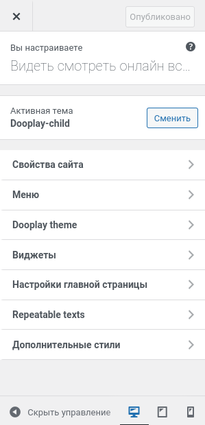

# Описание

## Настройки Customizer

Находится по относительной ссылке `/wp-admin/customize.php?return=%2Fwp-admin%2Fthemes.php%3Fpage%3Ddooplay` или админке *Внешний вид > Настроить*.
В дочерней теме добавлены 2 секции с настройками:
1. Dooplay theme
	- Фон для сайта. Рекомендуемая картинка 800x420 или больше.
2. Repeateable texts
	- **First screen text** - текст перед списком сериалов на главной странице.
	- **second text** - текст после списка сериалов на главной странице.
	- **Episode text after content** - текст после описания каждого эпизода. Поддерживает html разметку. Первый `%s` означает серию, второй сезон. `%s` обязателен для корректного форматирования.

Для нас важна еще 1 секция - Дополнительные стили. Именно здесь отражены все кастомные стили, которые дают конечный вид нашей теме.

## Общие настройки темы
Находится по относительной ссылке `/wp-admin/themes.php?page=dooplay`. Настройки поделены на секции. В данном описании не бует дублирования подсказок для опций, скорее заметки если что то не очевидно.
1. Settings - данная секция покрывает большинство настроек темы. Перед изменением рекомендуется сделать бекап.
	- Main settings - базовые настройки темы. Здесь важна настройка "Blog entries", в которой задается страница вывода постов. Важно настраивать именно здесь, потому что стандартная настройка wordpress может не иметь должного эффекта.
	- Customize - самый спецефический раздел здесь - редактирование главной страницы. Оно происходит путем определения порядка заранее запрограммированных блоков. Если определить в настройках главную, может выводиться контент страницы, но не данные блоки.
	- Comments
	- Links Module - ссылки на видео для эпизода. Не рекомендую менять первые два значения по умолчанию. Имеет смысл оставить добавление ссылок только для администратора.
	- Video Player - мы изменили стандартный блок на новый. Переместили список источников перед видеопроигрывателем, но на настройках это не отразилось.
	- WP Mail - если хостинг не позволяет корректно настроить работу почту, рекомендую включить отправку почты по SMTP.
	- Report and contact - возможность правообладателям обратиться для удаления материалов. Рекомендую настроить капчу и блокировку рекламных спам сообщений через blacklist.
2. Homepage Modules - в этом разделе редактируются настройки модулей. Они интутивно понятны, но обратите внимание, что порядок текстов из *Repetable texts* жесто задан через код и тут не меняется.
	- Featured titles
	- Blog entries
	- Main slider
	- TOP IMDb
	- Movies
	- TV Shows
	- TV shows > Seasons
	- TV Shows > Episodes
3. SEO - рекомендую вместо этого раздела использовать Yoast SEO и при необходимости убрать все хуки связанные с сео темы.
4. Advertising - рекламные текста. Обычно сюда вставляют js код партнерок CPA. Есть возможность задать несколько баннеров. При необходимости можно увеличить их кол-во и место положение через код.
5. Backup - сохранение настроек темы в формате json. Перед изменением настроек рекомендую сделать.

## Стили темы

## Перенос сайта

